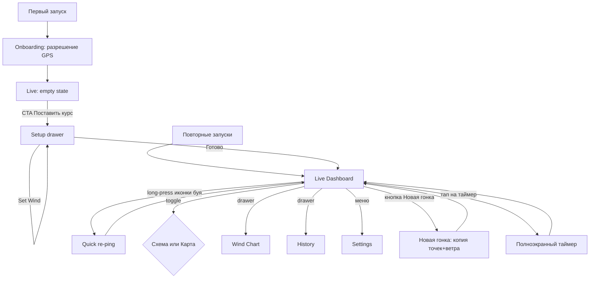

# Sailing Coach «Старт» — план PWA

> Адаптация плана iOS/SwiftUI-приложения. Парусная логика, дизайн и сценарии полностью сохранены, заменены только платформенные детали (SwiftUI → React, MapKit → Leaflet, CoreLocation → Geolocation API, AVFoundation → Web Audio, AppStorage/SwiftData → Zustand + IndexedDB).

## 1. Стек и базовая структура

- **Язык / UI**: TypeScript (strict) + React 18 + Tailwind CSS.
- **PWA**: Vite + `vite-plugin-pwa` (стратегия `injectManifest`), Workbox для офлайн.
- **Архитектура**: один глобальный Zustand-стор + чистые модули математики и сервисов.
- **Карта**: `leaflet` + `react-leaflet`, бесплатные тайлы OpenStreetMap (без API-ключа).
- **График**: `recharts`.
- **Хранилище**: IndexedDB через `idb` (debounced save 500мс).
- **Тесты**: `vitest`.

Целевое устройство — iPhone/iPad в Safari, поэтому ставка делается на тач-friendly UI, large hit-targets и адаптивный portrait+landscape без orientation lock.

## 2. Доменная модель (TypeScript)

```ts
type GeoPoint = { lat: number; lon: number; ts: number; accuracy?: number };
type WindReading = { ts: number; direction: number; source: 'manual' | 'heading' | 'slider' };
type Course = {
  id: string;
  name: string;            // "Гонка 3"
  pin: GeoPoint | null;
  committee: GeoPoint | null;
  windward: GeoPoint | null;
  windDirection: number | null;
  windSetAt: number | null;
  windHistory: WindReading[];
  notes: string;
};
type Regatta = { id: string; name: string; date: number; courseIds: string[] };
type Settings = {
  headingMode: 'true' | 'magnetic';
  holdMs: 1500 | 2500 | 4000;
  sound: boolean;
  layLineDeg: number; // 40..50
};
```

Стор хранится в IndexedDB одной записью `state/root` (debounced).

## 3. Парусная математика — `src/math/sailing.ts`

Все формулы — чистые функции, легко тестируемые. **Все bearing'и — true**, никогда не magnetic.

- **Bearing PIN → COMMITTEE** (азимут линии) через initial-bearing.
- **Длина линии** в метрах через haversine.
- **Перпендикуляр линии** = `bearing - 90°` (нормаль, направленная вверх — в идеале к ветру).
- **Line bias** (что выгоднее, PIN/СУДЬЯ):
  - `bias = wrap180(TWD - (lineBearing - 90))`
  - `bias > 0` → выгоднее **PIN** (левый), `bias < 0` → **СУДЬЯ** (правый), `|bias| < 1.5°` → нейтрально.
  - Преимущество в метрах: `lineLength * sin(|bias|)`.
- **Course skew** (какая сторона дистанции ближе к верхнему бую):
  - Ось курса = bearing от середины линии до windward.
  - `skew = wrap180(courseAxis - TWD)`.
  - `skew > 0` → правая сторона ближе, `skew < 0` → левая.
  - Преимущество: `(lineLength/2) * sin(|skew|)`.
- **Distance to line** от текущей позиции катера: проекция точки на отрезок pin↔committee (локальная плоская система с правильным cos(lat) для метров).
- **Time to burn** = `distance / SOG` (только при `SOG > 0.5 м/с`).

**Санити-предупреждения** (не блокирующие):

- `lineTooShort` — линия `< 20м`.
- `biasNearlyAlongLine` — `|bias| > 80°`.
- `windwardNotUpwind` — угол между (mid→windward) и TWD `> 90°`.

**Покрытие unit-тестами**: 22 теста, в т.ч. wrap-around 0/360°, отрицательный skew, очень короткая линия, windward в подветре, distance-to-segment для точки на/около/за пределами линии, time-to-burn null для низкой скорости.

## 4. Сервисы

- **`geolocation.ts`** (Geolocation API):
  - `start()` запускает `watchPosition` с `enableHighAccuracy: true`.
  - `subscribe(cb)` для подписки на live-fix.
  - `pingWithAveraging(holdMs)` — собирает все fix'ы за окно, фильтрует по `accuracy < 15м`, возвращает median lat/lon. Если набралось `< 3` приемлемых отсчётов — Promise rejects (UI покажет «GPS плохой»).
- **`orientation.ts`** (DeviceOrientationEvent):
  - На iOS Safari `DeviceOrientationEvent.requestPermission()` нужно вызвать **из user-gesture** — поэтому функция «Указать ветер» сама вызывает permission flow в обработчике клика.
  - Использует `webkitCompassHeading` (true heading на iOS), fallback на `(360 - alpha) % 360`.
- **`audio.ts`** (Web Audio API):
  - `OscillatorNode` 880Hz / 0.3с с экспоненциальным затуханием.
  - Контекст резюмируется только из user-gesture (старт таймера).
- **`timer.ts`**:
  - 5-4-1-0 ISAF. Гудки на 5:00, 4:00, 1:00 и 0:00 (последний длиннее).
  - SYNC снапит остаток к ближайшей минуте; PAUSE/RESUME/RESET.
  - В фоне работает через `setInterval`, но iOS может тротлить вкладку — это документированное ограничение.
- **`wakeLock.ts`**:
  - `navigator.wakeLock.request('screen')` при монтировании Live Dashboard, освобождает на unmount.
  - Перезахват при `visibilitychange === 'visible'`.
  - Если API недоступно (Safari < 16.4) — no-op.

## 5. Дизайн-токены (`src/design/tokens.ts`)

- Touch-target ≥ 88px, шрифты от 18px, главные значения 60–120px.
- Тёмно-синий фон `#0B1A2B`, deeper `#06101C`. Высокая контрастность.
- Морская палитра: `#D5302E` (PIN/port), `#2EA043` (COMMITTEE/starboard), `#3B82F6` (windward), `#FBBF24` (ветер).
- Все строки UI — на русском.

## 6. UI

### Onboarding (первый запуск)

Полноэкранный экран:

- Иконка ⛵ + название «Старт».
- Текст: «Программа использует GPS, чтобы запоминать положение знаков. Без доступа к геолокации основные функции работать не будут».
- Большая кнопка «Разрешить» → `getCurrentPosition()` для триггера разрешения.

### Empty state (Live Dashboard без курса)

- Большая иконка и текст «Курс не поставлен».
- Огромная CTA «Поставить курс» → открывает Setup drawer.

### Главный экран — Live Dashboard

```
┌──────────────────────────────────────────┐
│  [≡]   📍 30с   🚩 1мин   🔺 2мин  🌬1мин  [Сх|Карт] │
│                                          │
│   ←  P I N  ВЫГОДНЕЕ                     │
│        7°  •  +12 м                      │
│                                          │
│  ┌────────────────────────────────────┐ │
│  │   Schema или Map (toggle)           │ │
│  └────────────────────────────────────┘ │
│                                          │
│   ДИСТАНЦИЯ: ПРАВО +8°                   │
│                                          │
│  ┌──────────┬──────────┬──────────────┐ │
│  │  ⏱ 4:32  │ 🌬 215°  │ 📏 145м/8с  │ │
│  └──────────┴──────────┴──────────────┘ │
│  [Постановка] [+ Новая гонка]            │
└──────────────────────────────────────────┘
```

- **Long-press** на иконке буя (📍 / 🚩 / 🔺) в шапке — Quick Re-Ping без открытия drawer'а.
- Drawer'ы открываются по тапу на нижние кнопки или меню `≡`: Setup (постановка), History (история), WindChart (внизу), Settings (из меню).
- Wake Lock работает пока примонтирован Live Dashboard.

### Setup drawer

- Имя гонки (input).
- 3 крупные кнопки `PingButton` с прогресс-индикатором времени удержания: PIN (красная), СУДЬЯ (зелёная), ВЕРХ (синяя). Под каждой — текущая GPS-точность.
- Блок «Ветер»: «Указать ветер» (запрашивает компас iOS), слайдер коррекции ±20°, ручной ввод направления, текущий TWD.
- Кнопки «+ Новая гонка» и «Готово».

### Schema vs Map

- **Schema** (по умолчанию): SVG-треугольник с PIN (красный круг), СУДЬЯ (зелёный квадрат) и ВЕРХ (синий треугольник). Линия — градиент red→green. Стрелка ветра жёлтая. Перекос дистанции отражается смещением верхнего знака. Большие подписи.
- **Map**: Leaflet + OSM tiles, цветные маркеры в тех же координатах, видна позиция катера (жёлтая точка). Авто-fit по точкам.
- Состояние сохраняется в стор + IndexedDB.

### Timer (компактный + полноэкранный)

- Компактно в Live: цифры внизу, тап → fullscreen.
- Fullscreen: огромные цифры (28vh), цвет меняется зелёный → жёлтый → красный последняя минута.
- Кнопки SYNC, Pause/Resume, Reset, +Старт 4:00.
- Гудки 5/4/1/0.

### Wind Chart

- Recharts: ось X — время (HH:MM:SS), ось Y — TWD 0..360. Медиана — горизонтальная линия `#FBBF24`.

### History

- Список регат → гонок, текущая выделена.
- Поле заметок текущей гонки.
- (фото/видео — отложено в v2).

### Settings

- Heading: True (рекомендуется) / Magnetic.
- GPS hold time: 1.5 / 2.5 / 4 секунды.
- Звук таймера on/off.
- Lay-line угол 40°…50° (резерв на v2).
- Reset all data (с подтверждением).

## 7. Поток пользователя



## 8. v1 (что входит)

- Live Dashboard: одновременно favored end + course skew + таймер.
- Schema ↔ Map.
- GPS-усреднение при ping (median, hold 2.5с по умолчанию).
- Quick re-ping long-press.
- Empty state + onboarding.
- Кнопка «Новая гонка» (копирует точки и ветер).
- Settings (heading, hold time, sound, reset).
- График сдвигов ветра.
- Distance to line + time-to-burn.
- Заметки текстом.
- Поддержка landscape/portrait.
- Wake Lock.
- Морская палитра.
- Полностью офлайн (PWA + кэш OSM-тайлов).

## 9. v2 (roadmap)

- Голосовое озвучивание вердикта (`SpeechSynthesis`).
- Hapticts (если поддерживаются на устройстве).
- Кнопка «Поделиться схемой» (canvas + Share API).
- Голосовые мемо (`MediaRecorder`).
- Подсветка «свежести» ветра (старее 5 мин — желтый/красный).
- Лей-лайны.
- Bluetooth-датчик ветра (Web Bluetooth).
- Прогноз с Open-Meteo по координатам.
- Список спортсменов с парусными номерами.
- Учёт течения.

## 10. Что НЕ войдёт без отдельного запроса

- Облачная синхронизация и аккаунты.
- Видеозапись.
- Полноценный трек GPS катера (только ping-точки).
- Push-уведомления.
- Платная подписка / монетизация.

## 11. Известные ограничения PWA

- **iOS Safari < 16.4**: нет Wake Lock; держите экран включённым через настройки.
- **Background**: при сворачивании вкладки `watchPosition` останавливается. Таймер продолжает идти через `setTimeout`, но iOS может тротлить — гудки могут опоздать.
- **Compass permission**: `DeviceOrientationEvent.requestPermission()` нужно вызывать из user-gesture, поэтому компас включается только при тапе на «Указать ветер». При отказе — fallback на ручной ввод.
- **Battery**: GPS + screen-on быстро сажают аккумулятор, держите устройство на зарядке.
- **Map tiles**: на воде интернет может пропадать. Тайлы OSM кэшируются Service Worker'ом до 30 дней — пред-кэшируйте акваторию в Wi-Fi (откройте карту, прокрутите все зумы).

## 12. Ключевые файлы

- [src/math/sailing.ts](src/math/sailing.ts) + [src/math/sailing.test.ts](src/math/sailing.test.ts).
- [src/services/geolocation.ts](src/services/geolocation.ts), [orientation.ts](src/services/orientation.ts), [timer.ts](src/services/timer.ts), [audio.ts](src/services/audio.ts), [wakeLock.ts](src/services/wakeLock.ts).
- [src/store/useSailingStore.ts](src/store/useSailingStore.ts), [src/db/persistence.ts](src/db/persistence.ts).
- [src/views/Onboarding.tsx](src/views/Onboarding.tsx), [EmptyLive.tsx](src/views/EmptyLive.tsx), [LiveDashboard.tsx](src/views/LiveDashboard.tsx), [SetupSheet.tsx](src/views/SetupSheet.tsx), [PingButton.tsx](src/views/PingButton.tsx), [SchemaCanvas.tsx](src/views/SchemaCanvas.tsx), [MapCanvas.tsx](src/views/MapCanvas.tsx), [TimerView.tsx](src/views/TimerView.tsx), [WindChart.tsx](src/views/WindChart.tsx), [HistoryDrawer.tsx](src/views/HistoryDrawer.tsx), [SettingsView.tsx](src/views/SettingsView.tsx).
- [src/design/tokens.ts](src/design/tokens.ts).
- [src/sw.ts](src/sw.ts) — service worker (precache + кэш OSM-тайлов).
- [vite.config.ts](vite.config.ts) — конфиг Vite + PWA manifest.
